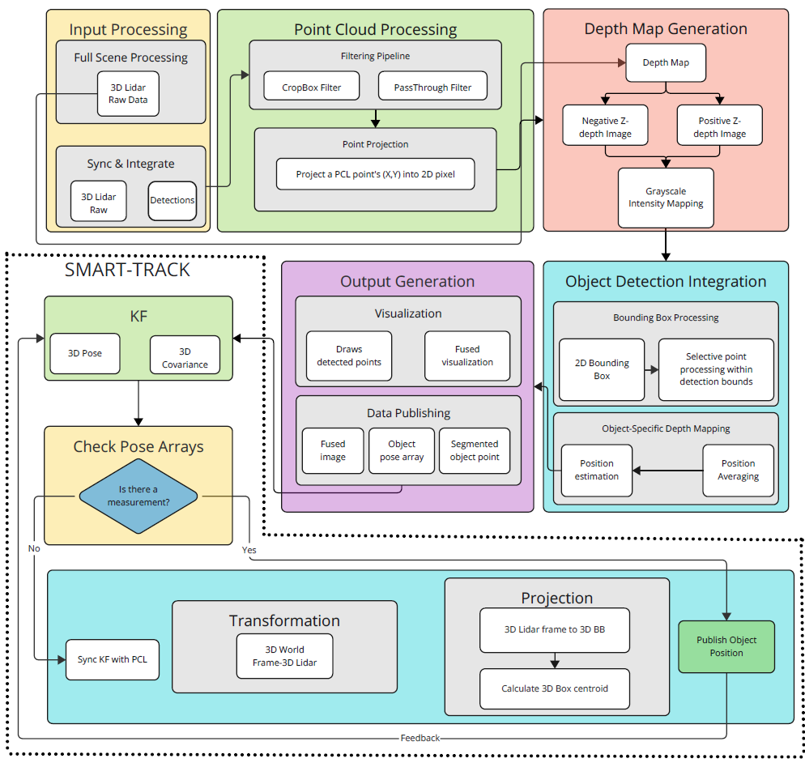

# DBEV-TRACK
Dual-LiDAR Bird’s-Eye View for Robust UAV 3D Tracking under Measurement Dropout

**NOTE** This work is submitted to IROS 2025 conference and currently under review. The full code will be released soon.

